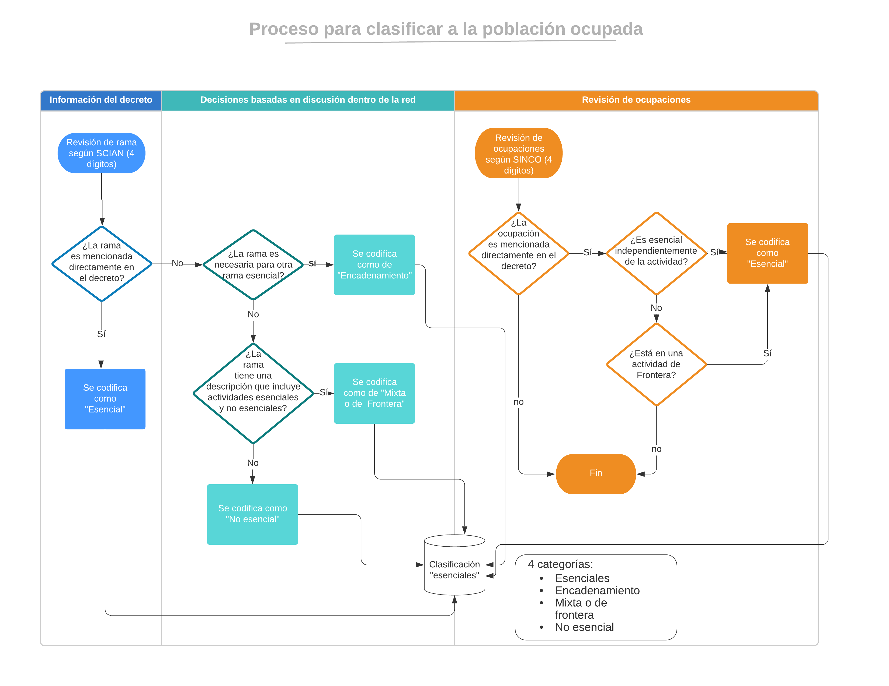

# Trabajo esencial y riesgo

 Clasificación de actividades y ocupaciones desarrollado por el Grupo TeTra.
 
 
 
Se trató un proceso colegiado con discusiones.

* A partir de estos elementos se obtiene la clasificación que se puede consultar [aquí](https://github.com/aniuxa/covid19_esenciales/blob/master/class_14may.xlsx)

* El código para utilizar esta clasificación en la ENOE se encuentra [acá](CODIGO_t120.do) 
